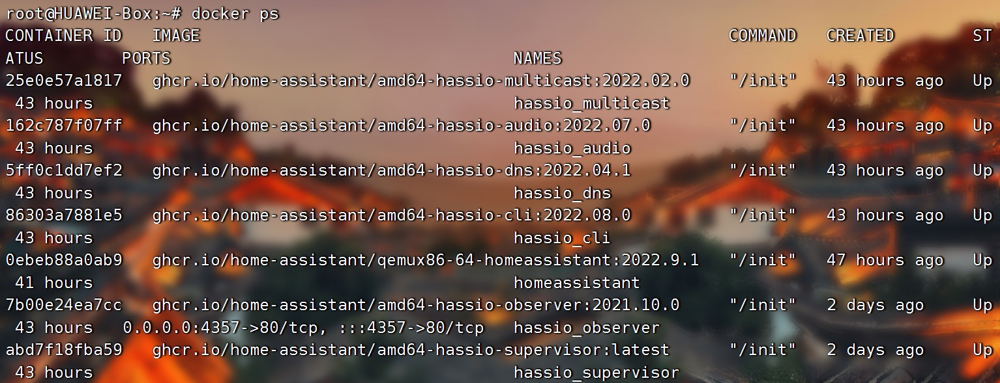

# 外贸电视盒子H96MAX RK3318盒子安装Armbian镜像教程

## H96Max RK3318 armbian刷机教程、安装 Home Assistant Supervised & HACS 以及外网访问的教程

### 0.准备工作

一台电脑，一个支持HDMI的显示屏，一张大于16G的TF卡，读卡器或SD卡套，USB接口的键盘(插在盒子上使用)以及需要的镜像文件、刷机工具、烧录工具和远程SHH工具。

### 1.下载Armbian镜像和刷机工具

使用作者提供的[镜像和刷机工具](./tools&images/readme.md)或[进入](https://users.armbian.com/jock/rk3318/)Armbian镜像网站下载下载最新的镜像和刷机工具。

本人使用的镜像是：***Armbian_22.05.0-trunk_Rk3318-box_bullseye_current_5.15.34_minimal.img***

### 2.安装armbian[^1]

1. 使用`balenaEtcher`将`multitool.img`烧录到TF卡上。烧录完成后，把镜像文件复制进`MULTITOOL`分区的`images`文件夹里；

2. 将TF卡插入电视盒，连接至显示屏并插入键盘和电源线。几秒钟后，蓝色 LED 开始闪烁并出现 `Multitool`；

3. 从菜单中选择 “`Erase flash`” 格式化盒子的所有分区；

4. 选择 “`Burn image to flash`”，然后选择目标设备（通常为 `mmcblk2`）和要刻录的镜像；

5. 等待刷机过程完成，然后从主菜单中选择 “`Shutdown`”；

6. 拔掉电源线和TF卡，将然后重新插上电源线；

7. 等待 10 秒，然后 LED 应该开始闪烁并且 HDMI 将打开。第一次启动过程需要几分钟或更长时间，因为文件系统将被调整大小，所以请耐心等待登录提示。

8. 首次启动时，系统会要求您输入您选择的 `root` 用户的密码以及普通用户的名称和密码并选择时区和 `WiFi`。也可以在设置完root密码后按 `ctrl+c` 退出设置(可以用 `armbian-config` 设置时区，语言，WiFi和其他个人设置)；

9. 运行 `rk3318-config` 以配置板特定选项(可以更改CUP的运行最大频率和EMMC的频率以及板子的灯的设置)；

10. 替换原镜像源sources.list(如果镜像源不是国内的,可以更换镜像源加速包的安装):

    ```shell
    sudo cp /etc/apt/sources.list /etc/apt/sources.list.bak
    sudo nano /etc/apt/sources.list
    ```

    将以下内容粘贴至 `sources.list`：

    ```shell
    deb https://mirrors.tuna.tsinghua.edu.cn/debian/ bullseye main contrib non-free
    # deb-src https://mirrors.tuna.tsinghua.edu.cn/debian/ bullseye main contrib non-free
    deb https://mirrors.tuna.tsinghua.edu.cn/debian/ bullseye-updates main contrib non-free
    # deb-src https://mirrors.tuna.tsinghua.edu.cn/debian/ bullseye-updates main contrib non-free
    deb https://mirrors.tuna.tsinghua.edu.cn/debian/ bullseye-backports main contrib non-free
    # deb-src https://mirrors.tuna.tsinghua.edu.cn/debian/ bullseye-backports main contrib non-free
    deb https://mirrors.tuna.tsinghua.edu.cn/debian-security bullseye-security main contrib non-free
    # deb-src https://mirrors.tuna.tsinghua.edu.cn/debian-security bullseye-security main contrib non-free
    ```

11. 更新包索引和升级包：

    ```shell
    sudo apt update
    sudo apt upgrade -y
    ```

12. 安装 `vim` ：

    ```shell
     sudo apt install -y vim
    ```

13. 安装 `git`：

    ```shell
    sudo apt install -y git
    ```

14. 安装 `pip3`：

    ```shell
    sudo apt install -y python3-pip
    ```

    替换原镜像源`pip.conf`

    ```shell
    sudo nano /etc/pip.conf
    #将以下内容粘贴至pip.conf
    [global]
    index-url=https://mirrors.aliyun.com/pypi/simple/
    ```

15. 安装`armbian-config` ：在命令行输入 

    ```shell
    sudo apt install -y armbian-config
    ```

16. 命令行输入 `reboot ` 重启设备；

17. 如果前面没有设置时区等，通过 `armbian-config` 命令进入设置，选择 `Network` 和 `Personal` 设置WiFi和时区等；

18. 在`System`中可以选择 `CPU` 选项设置 `CPU` 最大频率和运行模式；

19. 恭喜你完成了 `Armbian` 的安装！！！

### 3、安装Docker

1. 如果安装过 `Docker` ，先卸载：

    ```shell
    sudo apt-get remove docker docker-engine docker.io containerd runc
    ```

2. 新刷的系统没有安装过 `Docker`，先安装依赖： 

    ```shell
    sudo apt-get install -y apt-transport-https ca-certificates curl gnupg2 software-properties-common
    ```

3. 信任 `Docker` 的 `GPG 公钥`  ： 

    ```shell
    curl -fsSL https://download.docker.com/linux/debian/gpg | sudo gpg --dearmor -o /usr/share/keyrings/docker-archive-keyring.gpg
    ```

4. 添加软件仓库:

    ```shell
    echo "deb [arch=$(dpkg --print-architecture) signed-by=/usr/share/keyrings/docker-archive-keyring.gpg] https://mirrors.tuna.tsinghua.edu.cn/docker-ce/linux/debian $(lsb_release -cs) stable" | sudo tee /etc/apt/sources.list.d/docker.list
    ```

5. 下载 `Docker` 官方脚本，并使用阿里源进行 `Docker` r的安装：

    ```shell
    # 下载Docker安装脚本
    sudo curl -fsSL https://get.docker.com -o get-docker.sh
    # 使用阿里镜像源下载并安装Docker
    sudo sh get-docker.sh --mirror Aliyun
    ```

6. 换上阿里云的镜像加速：

    ```shell
    if [ ! -d /etc/docker ];then
       sudo mkdir -p /etc/docker
    fi
    sudo tee /etc/docker/daemon.json <<-'EOF'
    { 
        "log-driver": "journald",
        "registry-mirrors": [
        "https://z096vwit.mirror.aliyuncs.com",
        "https://rw21enj1.mirror.aliyuncs.com",
        "https://dockerhub.azk8s.cn",
        "https://reg-mirror.qiniu.com",
        "https://hub-mirror.c.163.com",
        "https://docker.mirrors.ustc.edu.cn"
        ]
    }
    EOF
    ```

7. 把`root`用户添加到docker用户组内：

    ```shell
    sudo usermod -aG docker pi
    ```

8. 重新加载`daemon.json`文件内容并重启`Docker` ：

    ```shell
    sudo systemctl daemon-reload
    sudo systemctl restart docker
    ```

9. 进入 `resolv.conf` 修改 `DNS`： `vim /etc/resolv.conf`：

    按 `a` 或 `i` 进入编辑模式，在后面追加

    ```shell
    nameserver 8.8.8.8
    nameserver 8.8.4.4
    ```

    按  `esc` 键进入命令模式，输入`:wq` 或 按`shift+z z` 保存并退出。

### 4.安装并配置Network-Manager

安装：

```shell
sudo apt install -y network-manager
```

配置：

```shell
if [ ! -s /etc/NetworkManager/conf.d/100-disable-wifi-mac-randomization.conf ];then
	cat << EOF | sudo tee /etc/NetworkManager/conf.d/100-disable-wifi-mac-randomization.conf
    [connection]
    wifi.mac-address-randomization=1

    [device]
    wifi.scan-rand-mac-address=no
    EOF
fi
```

p.s. 如果有 `ModemManage`，请禁用 `ModemManage`：

```shell
# 停止ModemManager
sudo systemctl stop ModemManager
# 禁止ModemManager开机自启
sudo systemctl disable ModemManager
```

### 5.安装Apparmor

```shell
# 安装
sudo apt install -y apparmor-utils jq software-properties-common apt-transport-https avahi-daemon ca-certificates curl dbus socat

# 使用vim打开/boot/cmdline.txt
sudo vim /boot/cmdline.txt
# 末尾添加
apparmor=1 security=apparmor
```

### 6.安装OS-Agent

`OS-Agent`并没有在Debian的软件源内，所以我们需要使用dpkg安装。最新`OS-Agent`的[下载地址](https://github.com/home-assistant/os-agent/releases/latest)在这。

这里下载并安装`1.3.0`版本的`OS-Agent`：

```shell
# 下载OS Agent 1.3.0
wget https://github.com/home-assistant/os-agent/releases/download/1.3.0/os-agent_1.3.0_linux_aarch64.deb
# 使用dpkg安装
sudo dpkg -i os-agent_1.3.0_linux_aarch64.deb
```

### 7.安装HACSS的其他依赖：

参考自https://github.com/home-assistant/supervised-installer

```shell
sudo apt-get install \
jq \
wget \
curl \
udisks2 \
libglib2.0-bin \
dbus -y
```

### 8.安装Home Assistant Supervised & HACS

==**在安装HASS前要先重启设备 ：**==

```shell
# 重启
reboot
```


#### 1)安装HASS(不支持Supervised) & HACS[^2]

1. 搜索镜像：

    ```Shell
    docker search home-assistant
    ```

2. 可以看到排在第一的 homeassistant/home-assistant 的星标最多，我们选择下载它：

    ```shell
    docker pull homeassistant/home-assistant
    ```

3. 创建容器：

    ```shell
    docker run -d --name="hass" -v ${HOME}/hass/mac_config -p 8123:8123 homeassistant/home-assistant
    ```

    - d：表示在后台运行
    - name：给容器设置别名（不然会随机生成，为了方便管理）；
    - v：配置数据卷（容器内的数据直接映射到本地主机环境，参考路径配置）；
    - p：映射端口（容器内的端口直接映射到本地主机端口最后便是刚才下载的镜像了，运行该容器）。

    可以把-v后面的路径改成你的本地存放该容器配置路径，运行成功会生成一串容器id；

4. 查看运行状态：

    ```shell
    docker ps
    ```

    有创建容器时指定的name的记录表示已经运行成功，直接打开 ip:8123 可以进入配置你的 HomeAssistant 

5. 启动/停止/删除容器：

    ```shell
    ## 启动
    docker start hass
    ## 停止
    docker stop hass
    ## 删除(删除之前要先stop容器)
    docker rm -f hass
    ## 开机自启容器
    docker update --restart=always
    ```

6. 安装HACS

    ```shell
    docker exec -it hass bash
    
    mkdir custom_components && cd custom_components && mkdir hacs && pwd
    
    git clone https://gitee.com/zhangyirui-xyz/hacsaa.git
    
    mv hacsaa/hacs_1.20.0.zip ./hacs
    
    cd hacs && unzip hacs_1.20.0.zip
    
    rm -rf hacs_1.20.0.zip
    
    cd .. && rm -rf hacsaa
    ```

7. 后续步骤在下面的[安装HACS](#hacs)中

#### 2)安装 Home Assistant Supervised & HACS[^3]

##### 1、安装Home Assistant Supervised

```shell
# 下载deb安装包
wget https://github.com/home-assistant/supervised-installer/releases/latest/download/homeassistant-supervised.deb
# 安装
sudo dpkg -i homeassistant-supervised.deb
```

之后，没有问题就会出现选项卡，我们选择`qemuarm-64`：


**p.s.安装过程可能要很久，如果还是不行，记得科学一下再重新安装。**

使用`docker ps`命令，查看Supervised的容器状态（如果并没有Homeassistant容器，等一段时间再试试，期间保持设备运行，Homeassistant会组建初始化完成）：



进入`ip:4357`，可以查看`Supervised`的状态：


但此时`ip:8123`无法进入Home Assisistant Supervised的管理页面，需要重启一次设备：

```shell
# 重启
sudo reboot
```

重启后，等待5分钟左右（第一次启动比较慢），就可以通过`ip:8123`在浏览器访问了。

##### 2、安装HACS<a id='hacs'> </a>

```shell
cd /usr/share/hassio/homeassistant

mkdir custom_components && cd custom_components && mkdir hacs

git clone https://gitee.com/zhangyirui-xyz/hacsaa.git

mv hacsaa/hacs_1.20.0.zip ./hacs

cd hacs && unzip hacs_1.20.0.zip

rm -rf hacs_1.20.0.zip

cd .. && rm -rf hacsaa
```

然后在管理页面，点击配置 -> 系统->重新启动，等待重启完成；


重启完成后，在配置-设备与服务-集成中点击添加集成；


在搜索框中搜索HACS，安装。（选择框全选上）


此时你要有一个github账号并登录


到此，你的HACS便安装完毕！

### 9.外网访问[^4]

1、如果你家的网络是外网ip，百度搜索访问的方法。

2、如果是内网，可以内网穿透。下面介绍一种稳定的透穿方法

#### 使用frp的前提

前提就是，你需要有一台带公网IP的设备，比如：云服务器（如：阿里云服务器、腾讯云服务器、百度云服务器、华为云服务器等）。

#### 准备工作

Frp是的原理，就是实现远程端对端的映射；所以，就需要服务端和客户端，**服务端，顾名思义，就是上面提到的云服务器；客户端，就是我们自己电脑/设备**。

获取frp：使用的是[fatedier](https://github.com/fatedier/frp/commits?author=fatedier)大佬的[项目](https://github.com/fatedier/frp)。

#####  服务端

下载对应你服务器版本的frp，一般Linux服务器都是amd64架构的。

##### 客户端

下载对应版本的frp，此设备上使用的是arm64架构的。

#### 配置并启动Frp

##### 放行端口

你使用到的端口（包括服务端和客户端）都需要放行。具体操作看你自己的服务器的操作说明（使用了宝塔面板的记得也要在面板中放行）。

##### 服务端

编辑**frps.ini**：

```shell
[common]
bind_port = 7000 # tcp端口
bind_udp_port = 7001 # udp端口，用不到可以去掉
dashboard_port = 7002 # 网页查看frp状态的端口，用不到可以去掉
vhost_http_port = 8124 # http端口，用不到可以去掉
vhost_https_port = 8125 # https端口，用不到可以去掉
max_pool_count = 10
max_pool_count = /var/logs/frps.log
log_level = info
dashboard_user = admin
dashboard_pwd = xxxx # 你的密码
token = xxxxxx # 设置一个token，在客户端要填写同样的token才能连接成功

```

**保存**，并在**终端执行**（可以用screen或者nohup，来后台运行，而且方便后续打开）：

```shell
nohup ./frps -c ./frps.ini
```

##### 客户端

编辑**frpc.ini**：

```shell
[common]
server_addr = x.x.x.x # 你自己的服务器ip
server_port = 7000
token = xxxxxx # 跟你在服务器上配置的token要一样
log_file = /var/log/frpc.log
log_level = info

[ssh]
type = tcp
local_ip = 127.0.0.1
local_port = 22
remote_port = 6006

[HASS] # 取一个你自己看的懂的名字
type = tcp
loacl_ip = 192.168.x.x # 你的设备的内网ip
local_port = 8123
remote_port = 8120
```

#### 可以设置成开机自启动服务项

##### 服务端

```shell
[Unit]
Description= Frp Service Service
After=network.target
Wants=network.target

[Service]
User=root
Type=simple
Restart=on-failure
RestartSec=5s
ExecStart=/你的frp路径/frps -c /你的frp路径/frps.ini

[Install]
WantedBy=multi-user.target
```

##### 客户端


```shell
[Unit]
Description= Frp Client Service
After=network.target
Wants=network.target

[Service]
User=root
Type=simple
Restart=on-failure
RestartSec=5s
ExecStart=/你的frp路径/frpc -c /你的frp路径/frpc.ini

[Install]
WantedBy=multi-user.target
```


## 参考:

[^1]:https://www.znds.com/tv-1203362-1-1.html
[^2]:https://blog.csdn.net/m0_67391683/article/details/124103709
[^3]:https://www.mintimate.cn/2022/03/29/raspberryInsatllHAS/#Docker
[^4]:https://www.mintimate.cn/2020/05/06/frp/
